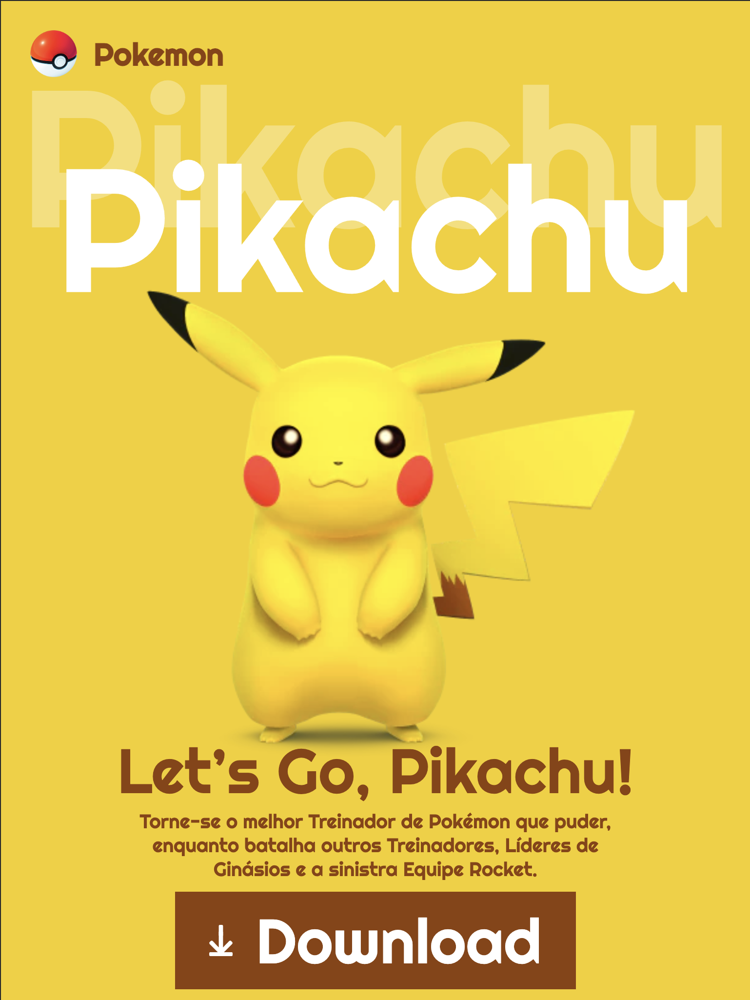

# 6-Lets-go-Pikachu

Layout feito como prática, desenvolvido durante as aulas de Linguagem de Marcação do curso Desenvolvimento de Sistemas do Senai

O site foi desenvolvido utilizando boas práticas, com o uso de tags semânticas e responsividade

## Layouts

### Layout para Desktop

### Layout para Tablet

### Layout para Celular

## Tecnologias
* HTML
* CSS
* Media Queries

## Autor
[Edvan Alves](<https://br.linkedin.com/in/edvan-alves>)